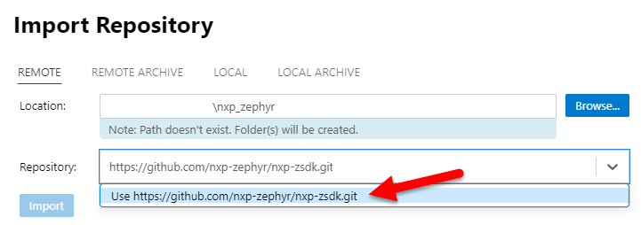
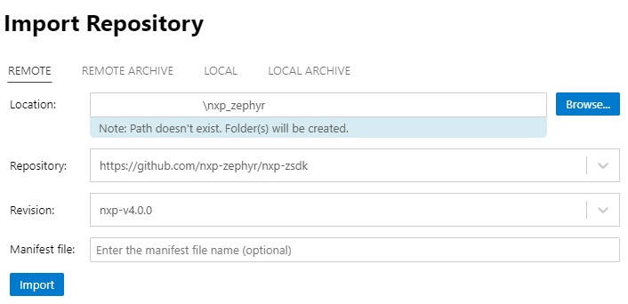
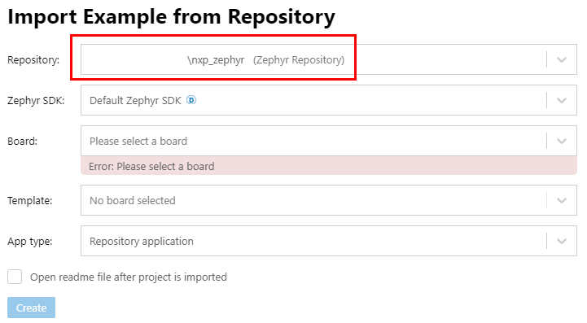

To learn more about NXP’s downstream ecosystem, see [Introduction to ZSDK Downstream](https://github.com/nxp-zephyr/nxp-zsdk/tree/main/doc/Introduction-to-ZSDK-Downstream.md).

Two options to get started are included here.  NXP provides the [MCUXPresso extension](https://www.nxp.com/design/software/development-software/mcuxpresso-software-and-tools-/mcuxpresso-for-visual-studio-code:MCUXPRESSO-VSC?tid=vanMCUXPRESSO-VSC) for Visual Studio Code (VS Code).  This option is the quickest option to: learn Zephyr when using NXP, import the required repos, build sample applications, download to NXP development boards, and debug.  Another option popular with Zephyr users is developing from Command Line Interface (CLI).

Generally, NXP recommends starting development with the latest Downstream release.  The release notes and latest release are found in the [Downstream releases](https://github.com/nxp-zephyr/nxp-zsdk/tree/main/doc/releases).  The steps below show how to import the release tag `nxp-v4.0.0`.

# Using VS Code
The MCUXpresso extension for VS Code can launch the MCUXpresso Installer, which installs all the tools and dependencies needed to develop with Zephyr.  This is the quickest option to get started with Zephyr.  To use this extension and the Installer, see the [extension wiki](https://github.com/nxp-mcuxpresso/vscode-for-mcux/wiki).  The wiki also includes detailed [lab guides](https://github.com/nxp-mcuxpresso/vscode-for-mcux/wiki/Training-Zephyr-Getting-Started) for developing with Zephyr.

After MCUXpresso Installer completes the installation, MCUXpresso for VS Code can be used to import the Downstream repo.
1. Use the MCUXpresso Quickstart Panel to **Import Repository**.
1. Browse to the folder to create the new Downstream workspace; these example steps create a folder named `nxp_zephyr` for the workspace.
1. Paste the URL for the repo.  The Downstream repo is at [https://github.com/nxp-zephyr/nxp-zsdk.git](https://github.com/nxp-zephyr/nxp-zsdk.git).  Note that after pasting the URL, click the pull-down option that says “Use https://github.com/nxp-zephyr/nxp-zsdk.git”.

	

1. Select the Revision of the repo to import.  This field defaults to the latest release tag, which is generally recommended, shown here as `nxp-v4.0.0`.  Use the pull-down menu to see other revision options.
1. Click the **Import button** to start the import.  This can take a long time to clone all the repos into the new workspace.

	

1. Import an example from the Downstream repo.  From the Quickstart Panel, click “Import Example from Repository”.  Select the workspace folder created in the previous step, shown here in `nxp_zephyr`.  Then select the NXP board and sample application template to import.

	

To learn more about using MCUXpresso for VS Code to develop with Zephyr, see the detailed Zephyr [lab guides](https://github.com/nxp-mcuxpresso/vscode-for-mcux/wiki/Training-Zephyr-Getting-Started).

# Using CLI
Many Zephyr users are already familiar with CLI development.  Developing with CLI is no different when using the Downstream repo.  With the CLI option, NXP’s [MCUXpresso Installer](https://github.com/nxp-mcuxpresso/vscode-for-mcux/wiki/Dependency-Installation) can also be used to install all tools and dependencies needed for Zephyr development.  Or to install the tools manually, see the [Zephyr Project Getting Started Guide](https://docs.zephyrproject.org/latest/develop/getting_started/index.html).

After the development environment is setup, initialize the Downstream workspace and clone all the repos using the West commands below.  In these example commands:
* `nxp_zephyr` is the name of the workspace folder that will be created and initialized.  Any name can be used for this.
* `nxp-v4.0.0` is the revision to checkout.  Generally NXP recommends starting with the latest release tag.

Start from the directory where the new workspace folder will be created, then use these commands:
```
$ west init -m https://github.com/nxp-zephyr/nxp-zsdk.git nxp_zephyr --mr nxp-v4.0.0
$ cd nxp_zephyr
$ west update
```

The final command may take a long time to clone all the repos.  After the update completes, use Zephyr’s West commands to build applications and flash to boards.  To learn more about developing with CLI, see the [Zephyr Project Getting Started Guide](https://docs.zephyrproject.org/latest/develop/getting_started/index.html).

# Further Help
* [MCUXpresso for VS Code](https://www.nxp.com/design/design-center/software/embedded-software/mcuxpresso-for-visual-studio-code:MCUXPRESSO-VSC?tid=vanMCUXPRESSO-VSC), [wiki](https://github.com/nxp-mcuxpresso/vscode-for-mcux/wiki) documentation and [Zephyr lab guides](https://github.com/nxp-mcuxpresso/vscode-for-mcux/wiki/Training-Zephyr-Getting-Started).
* Upstream Zephyr [Getting Started](https://docs.zephyrproject.org/latest/develop/getting_started/index.html) and [documentation](https://docs.zephyrproject.org/latest/)
* NXP [Zephyr Knowledge Hub](https://community.nxp.com/t5/Zephyr-Project-Knowledge-Base/Zephyr-Knowledge-Hub/ta-p/2008548)
* [NXP and Zephyr™ OS Webinar Series](https://www.nxp.com/pages/nxp-and-zephyr-os-webinar-series:TS-NXP-AND-ZEPHYR-OS-WEBINAR-SERIES) to get an overview of Zephyr and key topics
* [NXP Support Community forum for Zephyr](https://community.nxp.com/t5/Zephyr-Project/bd-p/Zephyr-Project)
