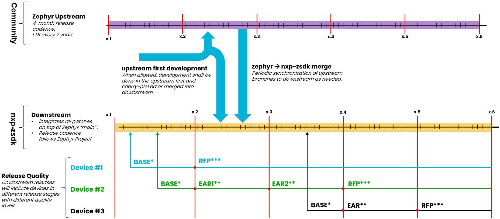

ZSDK is NXP’s primary downstream enablement for Zephyr.

Open-Source Terminology:
* **Upstream** repository (repo): the source repo and project.  These contributions are for the whole open-source community.  [Zephyr Project](https://www.zephyrproject.org/learn-about/) governs the upstream repo at [github.com/zephyrproject-rtos/zephyr](https://github.com/zephyrproject-rtos/zephyr), and anyone can contribute to it.
* **Downstream** repos: clones (or forks) of upstream repos, which can be modified and re-distributed.  The [nxp-zephyr repo](https://github.com/nxp-zephyr/nxp-zephyr) is a downstream fork of the Zephyr Project [upstream repo](https://github.com/zephyrproject-rtos/zephyr).

# Introduction
NXP was a founding member of the Zephyr Project and is fully committed today as a Platinum Member.  NXP provides upstream support for a broad range of [hardware platforms](https://docs.zephyrproject.org/latest/boards/nxp/index.html).  NXP also provides this downstream ecosystem for early access to new products, for features that cannot be upstreamed, and to provide Long-Term Support (LTS).

ZSDK key characteristics:
* **Derived from Zephyr Project Upstream**: inherits code, features, and updates from the Zephyr Project.
* **Custom Modifications**: Zephyr Project upstream provides the foundation while **nxp-zsdk** allows NXP to customize the software to meet our customer needs. NXP middleware solutions or 3rd party value components can be added.
* **Faster Time-to-Market**: NXP can integrate upstream improvements while simultaneously rolling out custom enhancements. This provides easier and more integrated early access for our devices.
* **Controlled Innovation**: By providing this Downstream ecosystem, NXP maintains better control over the roadmap. NXP can better establish milestones for releases and contributions and meet customer expectations.
* **Additional Long-Term Stability**: NXP has the flexibility to add new SOC and board support after an LTS release, which is not possible in the upstream.  The Downstream LTS lifecycle tracks upstream (2yrs + 6 months overlap with following LTS release).

# NXP ZSDK Downstream Development
When allowed, development shall be done in the Upstream first, and cherry-picked or merged into the Downstream.   The Downstream repo will be periodically synchronized to the Upstream repo, to keep them closely aligned.  Downstream versions closely track with the Zephyr upstream releases.

Because development is done in a common “main” branch, a Downstream release will include support for devices in different release stages with different quality levels.  Some release stages include:
* **BASE**: initial Baseline Support, adds a new board to the repo
* **EAR**: Early Access Release
* **RFP**: Release for Production

	

# Structure
NXP’s ZSDK is a collection of repos for NXP’s Zephyr enablement.  The ZSDK uses the [West](https://docs.zephyrproject.org/latest/develop/west/index.html) tool to clone, synchronize, and organize these repos.  [nxp-zsdk](https://github.com/nxp-zephyr/nxp-zsdk) is the top-level manifest repo, which includes a [manifest file](https://github.com/nxp-zephyr/nxp-zsdk/blob/main/west.yml) that instructs West which repos to clone into the development workspace, and which revisions of each repo.  Some key repos include:
* [nxp-zsdk](https://github.com/nxp-zephyr/nxp-zsdk): the manifest repo for the downstream enablement.  This manifest can pull in a mixture of upstream and downstream repos into the development workspace, and leaves out unneeded non-NXP HAL repos.  This repo is the primary target for early development of SOC and board definition enablement before upstreaming.
* [nxp-zephyr](https://github.com/nxp-zephyr/nxp-zephyr): downstream fork of the Zephyr repo, closely synchronized with the upstream repo.
* [hal_nxp](https://github.com/nxp-zephyr/hal_nxp): downstream fork of the low-level Hardware Abstraction Layer (HAL), which includes the MCUXpresso SDK drivers.

After initializing the workspace, the ZSDK structure includes these folders and more:
```
nxp_zephyr/
│
├── modules/                    # other modules pulled in by West
│   ├── crypto/
│   │   ├── els_pkc/            # NXP hardware drivers
│   │   ├── mbedtls/            # NXP downstream fork
│   │   └── psa_crypto_driver/  # NXP downstream fork
│   └── hal/
│       ├── cmsis/
│       └── nxp/                # NXP HAL with MCUXpresso SDK drivers
├── zephyr/                     # NXP downstream fork
└── zsdk/                       # NXP downstream manifest repo
```
# Getting Started
To start using the ZSDK, see [ZSDK Getting Started](https://github.com/nxp-zephyr/nxp-zsdk/tree/main/doc/Getting-Started.md).
